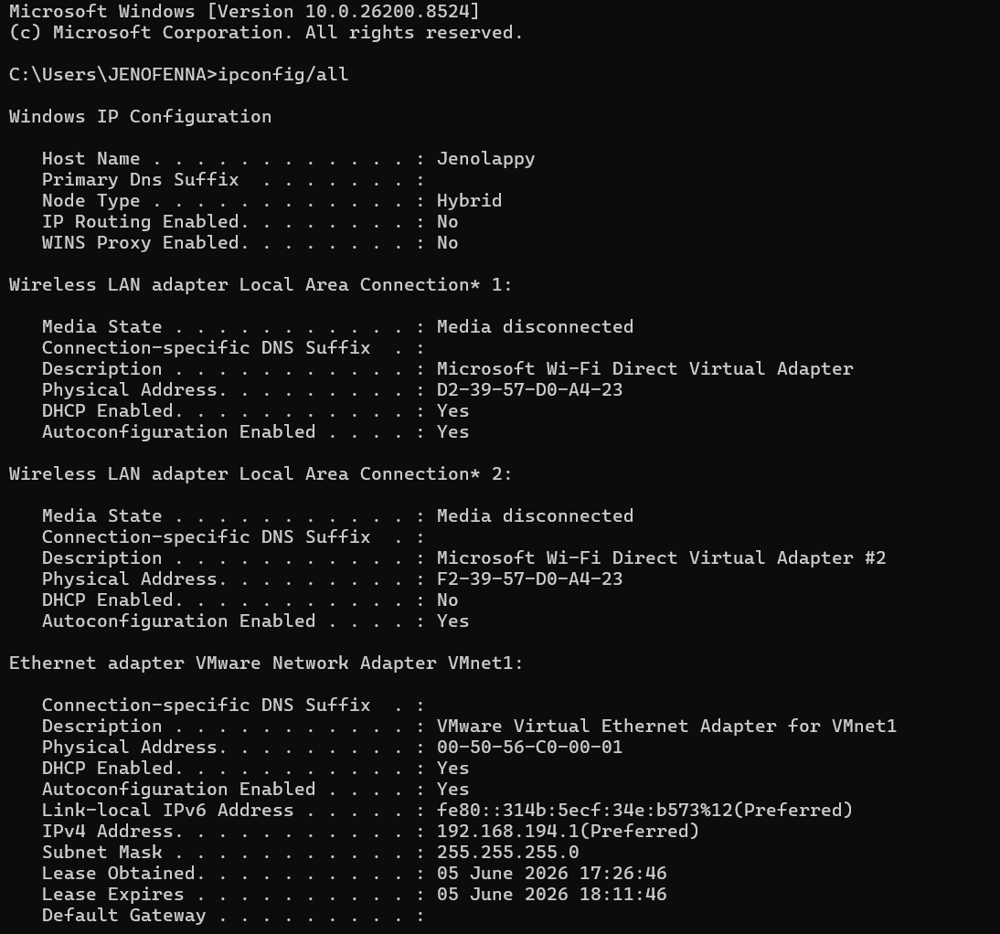
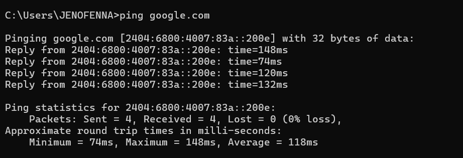
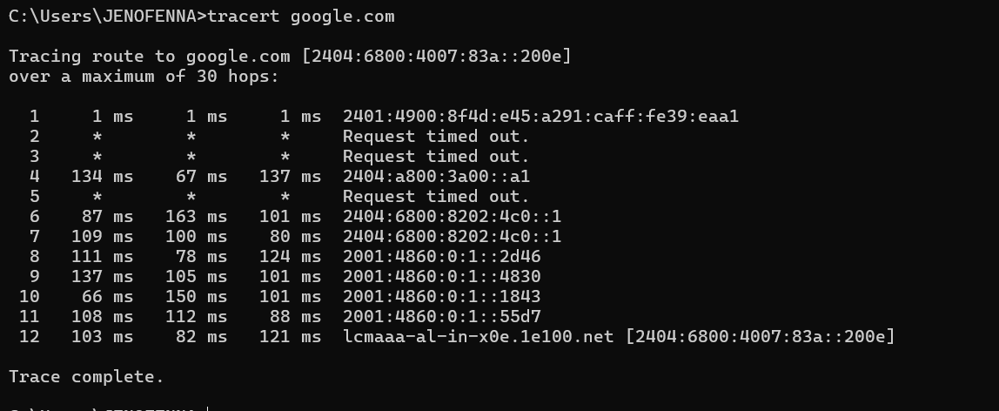

** Networking Task 01: Understanding Your Network Environment **

Student Information

Name: Jenofenna Christo  
Date: June 2026

---

Objective

The purpose of this task is to understand the basic components of a network and identify the network configuration of my system.

---

Part A: Network Information

Device Details

| Parameter | Value |
|------------|---------|
| Hostname | Jenolappy |
| IPv4 Address | 192.168.194.1 |
| MAC Address | Available in ipconfig output |
| Default Gateway | Available in network configuration |
| DNS Server | Available in network configuration |

---


---

Part B: Basic Networking Concepts

What is an IP Address?

An IP Address (Internet Protocol Address) is a unique numerical address assigned to a device on a network. It allows devices to communicate with each other.

What is a MAC Address?

A MAC Address (Media Access Control Address) is a unique hardware identifier assigned to a network interface card by the manufacturer.

What is a Default Gateway?

A Default Gateway is the networking device, usually a router, that forwards traffic from a local network to external networks such as the Internet.

What is DNS?

DNS (Domain Name System) translates domain names such as google.com into IP addresses that computers use to locate servers on the Internet.

---

Difference Between Public IP and Private IP

| Public IP | Private IP |
|------------|------------|
| Used on the Internet | Used inside local networks |
| Assigned by ISP | Assigned by Router |
| Globally unique | Can be reused |
| Example: 49.x.x.x | Example: 192.168.x.x |

---

Part C: Basic Network Diagram

```text
Internet
    │
    ▼
Wi-Fi Router
    │
    ▼
Laptop (Jenolappy)
```

---

Part D: Network Connectivity Test

Commands Used

```cmd
ipconfig /all
ping google.com
tracert google.com
```

Ping Test Result

Was the ping successful?

Yes. The ping test was successful.

Ping Statistics

- Packets Sent: 4
- Packets Received: 4
- Packets Lost: 0
- Average Response Time: 118 ms

---

Traceroute Result

How many hops were shown?

12 hops were displayed before reaching Google.
What is the purpose of traceroute?

Traceroute identifies the path taken by data packets from the source device to the destination server. It helps diagnose network delays, routing issues, and connectivity problems.

---

Screenshots Included

- ipconfig /all output
- ping google.com output
- tracert google.com output

---

IP Configuration Screenshot



 Observation

The `ipconfig /all` command was used to display detailed network configuration information, including hostname, IP address, network adapters, and DHCP settings.

---

Ping Test Screenshot



Observation

The `ping google.com` command was used to test connectivity between the local system and Google's servers.

Results:

- Packets Sent: 4
- Packets Received: 4
- Packets Lost: 0
- Minimum Time: 74 ms
- Maximum Time: 148 ms
- Average Time: 118 ms

The successful replies indicate that the system has a stable Internet connection.

---

Traceroute Screenshot



### Observation

The `tracert google.com` command was used to trace the path taken by packets from the local computer to Google's servers.

Results:

- Total Hops: 12
- Destination reached successfully
- Some intermediate routers showed "Request Timed Out", which is normal because certain routers block ICMP responses for security reasons

Learning Outcomes

Through this task, I learned:

- Network configuration basics
- IPv4 and IPv6 addressing
- MAC Address identification
- DNS functionality
- Role of Default Gateway
- Network connectivity testing
- Using ping command
- Using traceroute command
- Understanding packet routing on the Internet
- Basic troubleshooting of network issues

---

Conclusion

This task provided hands-on experience in identifying network settings and testing Internet connectivity. I learned how devices communicate within a network and how data travels through multiple routers before reaching a destination server. The practical use of networking tools such as ipconfig, ping, and tracert improved my understanding of fundamental networking concepts that are essential in cybersecurity.

---

Repository Structure

```text
Networking_Task_01_Jenofenna
│
├── README.md
│
├── Screenshots
│   ├── ipconfig.png
│   ├── ping.png
│   └── tracert.png
│
├── Answers
│   └── answers.txt
│
└── Command_Outputs
    └── outputs.txt
```
